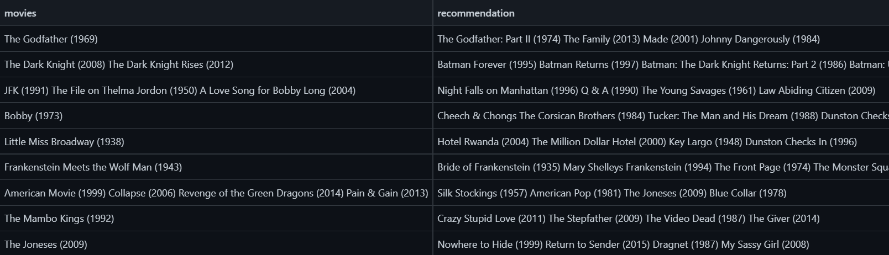

# Movie-Recomendation-System

>`Purpose:` Course Project at [IIITD](https://www.iiitd.ac.in/)

>`Instructions:` (Credits- [Data Mining][(http://techtree.iiitd.edu.in/viewDescription/filename?=CSE201)](http://techtree.iiitd.edu.in/viewDescription/filename?=CSE506))

>`Recommender System Output Screenshot`

&nbsp
<!-- &nbsp
&nbsp
&nbsp
&nbsp -->

Using the association rule mining techniques, build a recommendation system for the Movie dataset. 
The system would be able to recommend four movies based on a user profile i.e. what set of movies he/she has watched in the past.

